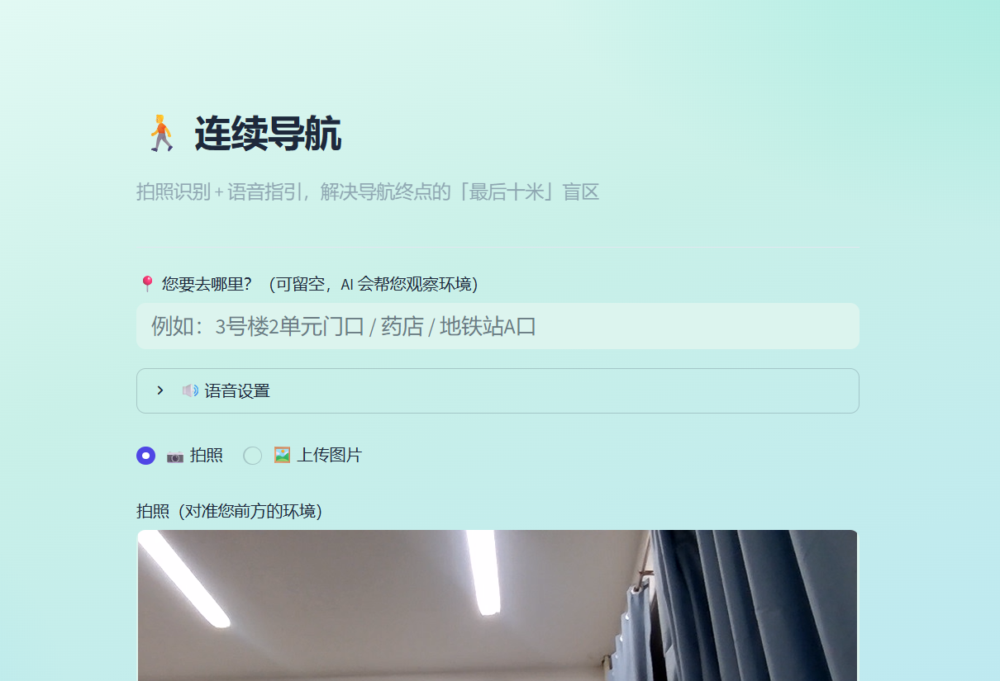
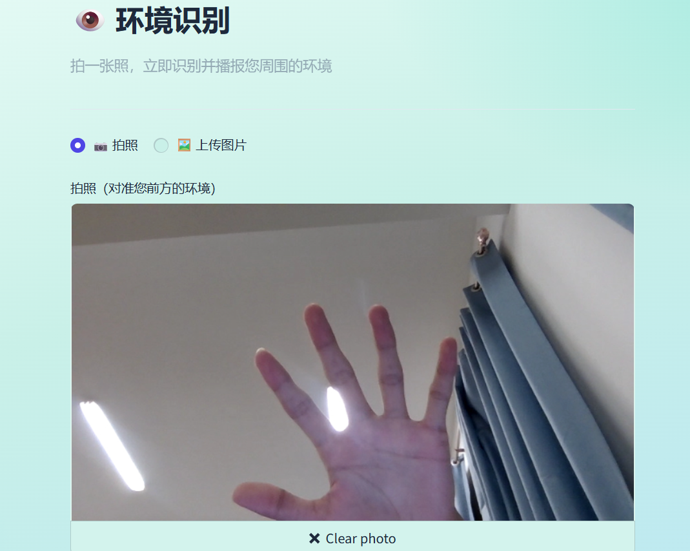

# 作品简介（≤800字，无格式文本）

「瞳行」是一款面向视障群体的 AI 出行与生活辅助智能体。针对视障者出行中 GPS 导航终点与实际目的地之间的「最后十米」盲区——找不到具体入口、台阶、门牌——系统通过手机拍照，调用国产多模态大模型智谱 GLM-4V-Flash 识别台阶、障碍物、红绿灯、门牌等环境信息，再由大语言模型 GLM-4-Flash 结合多轮导航上下文生成简洁口语化指引，经 Edge-TTS 实时语音播报。

作品提供四大功能：连续导航（多轮上下文生成连贯指引）、环境识别（单次拍照即时播报）、文字朗读（识别招牌票据药品说明）、紧急求助（生成自救建议与求助喊话）。系统采用子智能体编排架构，将视觉识别、指引生成、语音合成、文字朗读、紧急求助拆分为五个职责单一的子智能体，由编排器统一调度，形成「拍照→识别→指引→播报」的完整流水线。

作品基于国产大模型与免费技术栈开发，具备低成本、易推广特点，致力于用 AI 技术为视障群体构建一条安全、可感知的出行通道。

---

> 提交时请在本页插入 **3 幅展示软件核心功能的截图**（jpg/png，如：连续导航指引结果、环境识别详情、紧急求助界面），并将本文件转为纯文本（.txt，文件≤1MB）随作品提交。

